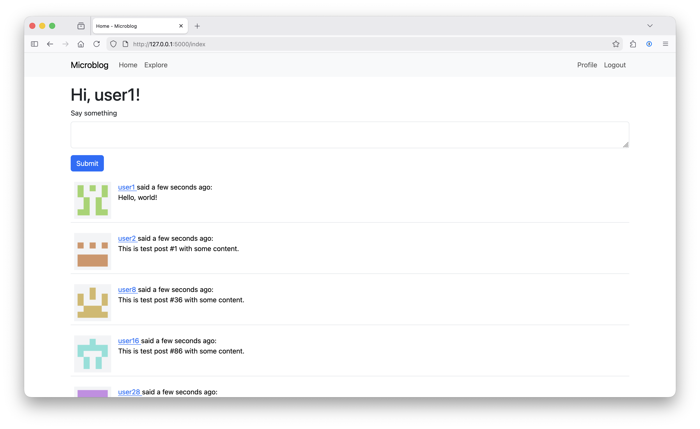

# Microblog

A Twitter-style social microblogging app built with Flask. Users can post, follow others, and view personalized feeds.

Based on [Miguel Grinberg's Flask Mega-Tutorial](https://blog.miguelgrinberg.com/post/the-flask-mega-tutorial-part-i-hello-world) with some extra fun features.



## Tech Stack

- **Backend:** Flask, SQLAlchemy, Flask-Login, Flask-WTF
- **Frontend:** Jinja2, Bootstrap 5
- **Database:** SQLite (default), PostgreSQL supported
- **Tools:** Alembic migrations, unittest, pydenticon avatars, uv package manager

## Features

- User registration and authentication
- Create posts (140 char limit)
- Follow/unfollow users
- Home feed (posts from followed users) and explore feed (all posts)
- User profiles with auto-generated identicon avatars
- Pagination

## Setup

```sh
# Install dependencies
uv sync

# Initialize database
flask db upgrade

# (Optional) Seed with sample data (50 users, 200 posts)
flask seed-db

# Run dev server
flask run
```

App runs at <http://127.0.0.1:5000>.

## Commands

| Command                     | Description                        |
| --------------------------- | ---------------------------------- |
| `flask run`                 | Start dev server                   |
| `flask db upgrade`          | Run migrations                     |
| `flask db migrate -m "msg"` | Create new migration               |
| `flask seed-db`             | Load sample data                   |
| `flask shell`               | Interactive shell with app context |
| `python tests.py`           | Run unit tests                     |

## Project Structure

```
app/
├── __init__.py      # App factory, extensions
├── models.py        # User, Post models
├── routes.py        # View functions
├── forms.py         # WTForms definitions
├── cli.py           # Custom CLI commands
├── errors.py        # Error handlers
├── templates/       # Jinja2 templates
├── static/          # CSS, JS, favicon
└── utils/           # Identicons, logging
migrations/          # Alembic migrations
config.py            # App configuration
microblog.py         # Entry point
tests.py             # Unit tests
```

## Configuration

Environment variables (optional):

| Variable       | Default            | Description                        |
| -------------- | ------------------ | ---------------------------------- |
| `SECRET_KEY`   | `"dev"`            | Session secret (set in production) |
| `DATABASE_URL` | `sqlite:///app.db` | Database connection string         |

Flask config is in `.flaskenv`:

```
FLASK_APP=microblog.py
FLASK_DEBUG=1
```
